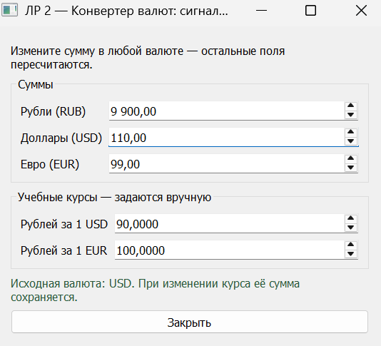
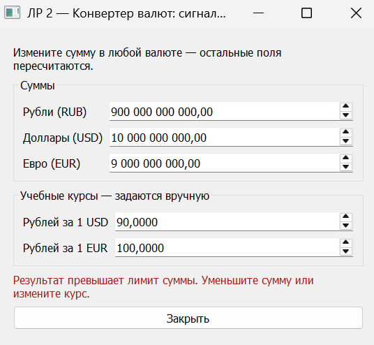

# Основы проектирования графического интерфейса компьютерных систем

# ЛР 2. Сигналы и слоты: конвертер валют
**Выполнил: студент группы 6231-010402D Жукова Анна**

Программа расширяет исходный макет `l2discuss` из [задания ЛР 1–2](../задания_лр1_2.txt). В окне находятся связанные поля рублей, долларов и евро: изменение любой суммы автоматически пересчитывает две другие. Реализованы пользовательские сигналы и слоты PyQt5, отдельная модель данных и обработка недопустимых значений.

## Запуск

Нужны Python 3.10 или новее, pip и графический рабочий стол. Из директории `gui`:

Windows (PowerShell):

```powershell
py -m venv .venv
.venv\Scripts\python.exe -m pip install -r requirements.txt
.venv\Scripts\python.exe l2discuss\main.py
```

## Возможности и пример

- Ввод суммы в любой из трёх валют с точностью до двух знаков.
- Изменение курса рубля за доллар и рубля за евро с точностью до четырёх знаков.
- Пересчёт по мере ввода корректного числа и при использовании стрелок поля.
- Сохранение суммы последней изменённой валюты при обновлении курсов.
- Проверка диапазона и восстановление предыдущих корректных значений при переполнении результата.

Курсы **учебные**, вводятся вручную и не загружаются из интернета. Начальные значения: 1 USD = 90 RUB, 1 EUR = 100 RUB, сумма — 9000 RUB.

| Действие | RUB | USD | EUR |
|---|---:|---:|---:|
| Запуск | 9000,00 | 100,00 | 90,00 |
| Ввести 200 USD | 18000,00 | 200,00 | 180,00 |
| Изменить курс USD на 95 RUB | 19000,00 | 200,00 | 190,00 |
| Ввести 50 EUR | 5000,00 | 52,63 | 50,00 |

## Формулы и ограничения

Пусть `r[USD]` и `r[EUR]` — количество рублей за единицу валюты, а `r[RUB] = 1`. Тогда:

```text
сумма_в_рублях = исходная_сумма × r[исходная_валюта]
сумма_в_целевой_валюте = сумма_в_рублях / r[целевая_валюта]
```

Суммы: от 0 до 1 000 000 000 000 включительно. Курсы: от 0,0001 до 1 000 000 включительно. Отрицательные, нулевые курсы и нечисловые значения недопустимы. Если хотя бы один результат превышает допустимую сумму, изменение отклоняется целиком; поля возвращаются к предыдущим значениям, внизу появляется объяснение. Это исключает незаметное обрезание результата границами виджета.

## Архитектура и сигналы-слоты

| Файл | Назначение |
|---|---|
| `main.py` | `ConverterWindow`: поля, связи сигналов со слотами, отображение результатов и ошибок. |
| `cl2.py` | `CurrencyModel(QObject)`: исходная сумма, выбранная валюта, курсы, слоты изменения данных, сигналы результатов. |
| `currency.py` | Функция `convert`: расчёты и проверки без зависимости от Qt. |

Исходные неработающие импорты `cl1`, циклический импорт `main` и неопределённый `pyqtSignalDolar` заменены полноценной моделью.

Последовательность обработки:

1. `QDoubleSpinBox.valueChanged` вызывает пользовательский сигнал окна `amount_edited(str, float)`.
2. Сигнал подключён к слоту `CurrencyModel.set_amount(str, float)`.
3. Модель проверяет данные, рассчитывает суммы и отправляет `amounts_changed(dict)`.
4. Слот окна `show_amounts(dict)` обновляет поля.
5. На время программного обновления используются объекты `QSignalBlocker`, поэтому изменение связанных полей не вызывает новые расчёты по кругу.

Для курсов используется цепочка `valueChanged → publish_rates → rates_edited(float, float) → set_rates`. При ошибке модель отправляет `error_occurred(str)`, связанный со слотом `show_error(str)`.

## Проверка


