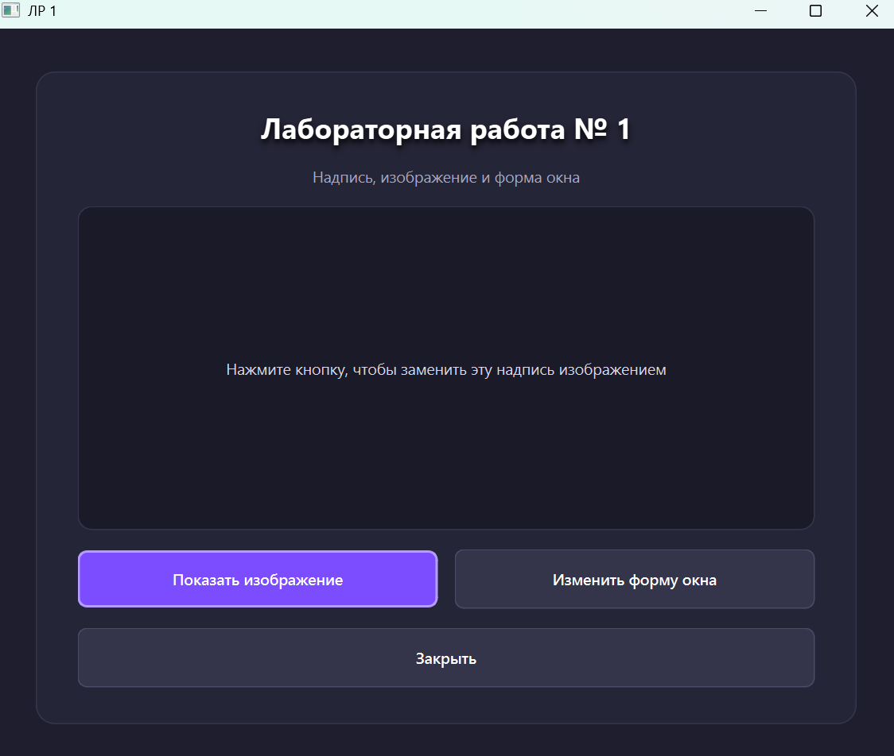
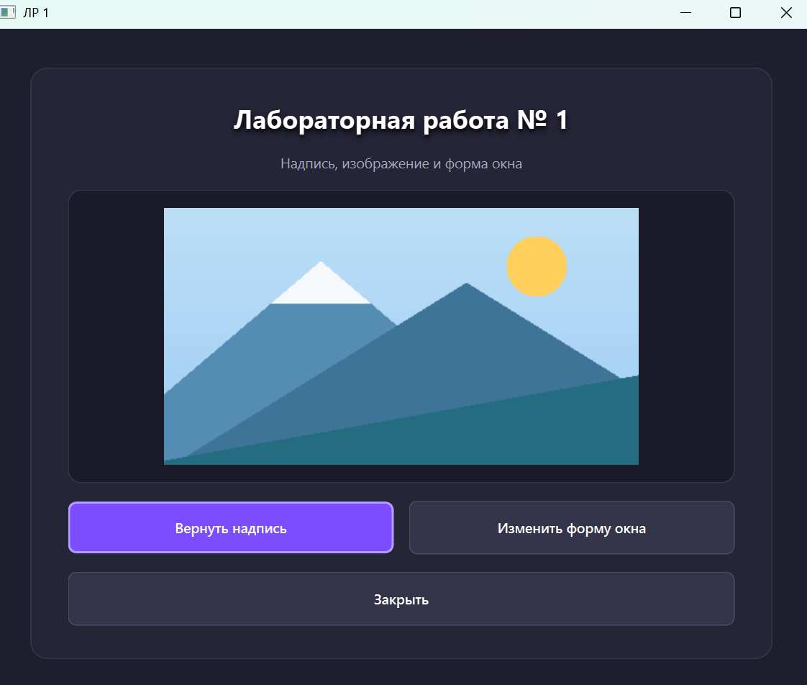
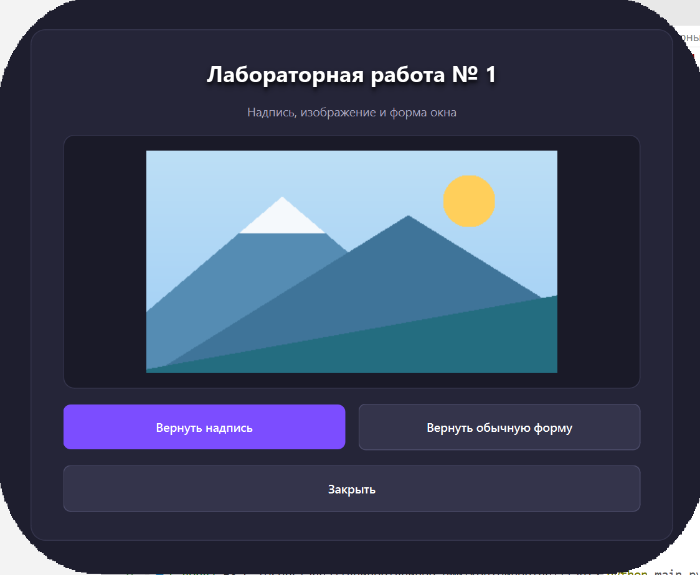

# Основы проектирования графического интерфейса компьютерных систем

## ЛР 1. Надпись и изображение
**Выполнил: студент группы 6231-010402D Жукова Анна**

Программа на Python и PyQt6 показывает надпись, которая по нажатию кнопки заменяется изображением. Повторное нажатие возвращает исходный текст. Вторая кнопка меняет прямоугольную форму окна на форму PNG-маски и обратно.

## Запуск

Нужны Python 3.10 или новее, pip и графический рабочий стол. Команды выполняются из директории `gui`.

Windows (PowerShell):

```powershell
py -m venv .venv
.venv\Scripts\activate
.venv\Scripts\python.exe -m pip install -r requirements.txt
.venv\Scripts\python.exe lab1\main.py
```

## Использование

1. После запуска отображаются надпись и три кнопки.
2. **«Показать изображение»** заменяет текст в том же `QLabel` картинкой. Повторное нажатие **«Вернуть надпись»** восстанавливает текст.
3. **«Изменить форму окна»** применяет форму из `window_skin.png`; фигурное окно можно перетаскивать мышью.
4. **«Закрыть»** или клавиша `Esc` завершают работу. Кнопки доступны с клавиатуры через `Tab` и пробел.

## Устройство программы

| Файл | Назначение |
|---|---|
| `main.py` | Настройка Qt, класс `Lab1Window`, интерфейс и обработчики кнопок. |
| `assets/landscape.png` | Изображение, заменяющее надпись. |
| `assets/window_skin.png` | Альфа-маска для изменения формы окна. |
| `assets/build_assets.py` | Воспроизводимое создание учебных PNG из геометрических примитивов, без дополнительных библиотек. Для обычного запуска не нужен. |

Сигнал `clicked` первой кнопки связан со слотом `toggle_image`. Для изображения используется `QLabel.setPixmap`, для восстановления текста — `QLabel.setText`. Картинка масштабируется с сохранением пропорций. Вторая кнопка вызывает `toggle_shape`: маска масштабируется под текущий размер окна, обновляется в `resizeEvent`, а повторное нажатие вызывает `clearMask()`.

## Проверка



