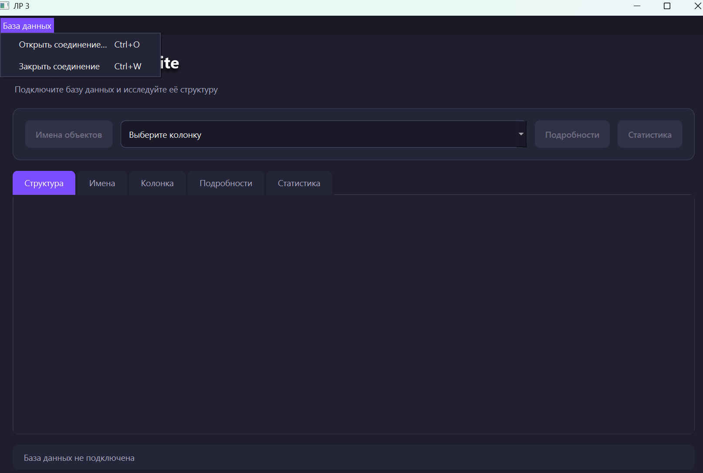
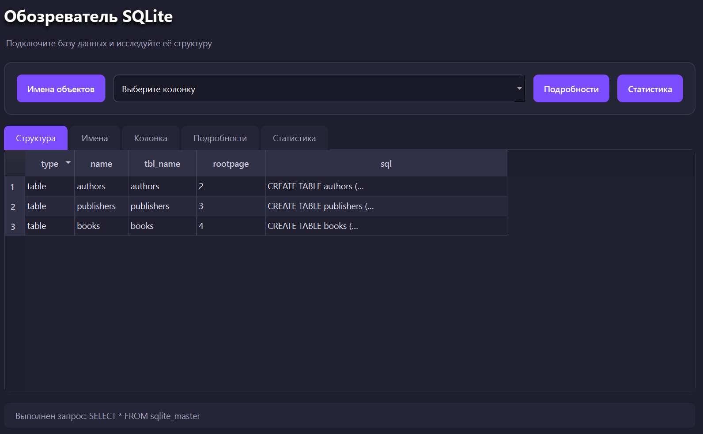
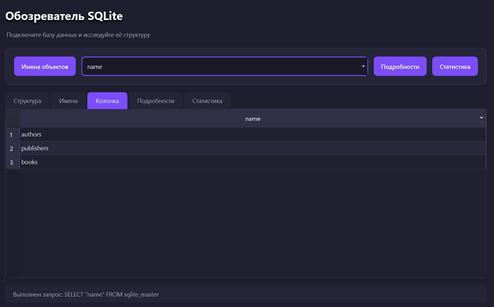
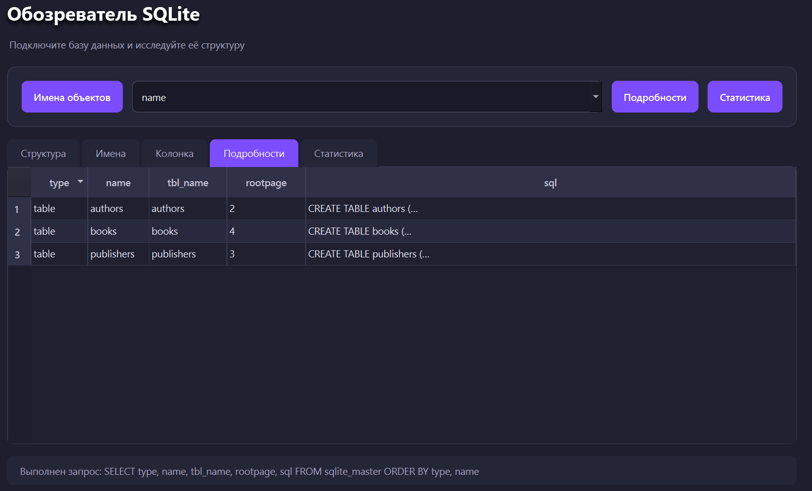

# Основы проектирования графического интерфейса компьютерных систем

# ЛР 3. Представление таблиц и работа с SQL
**Выполнил: студент группы 6231-010402D Жукова Анна**

Приложение `main.py` реализует задание из `лаба3gui.docx` на PyQt6 и QtSql.

В меню **«База данных»** доступны **«Открыть соединение…»** для выбора файла SQLite через `QFileDialog` и **«Закрыть соединение»** для закрытия соединения и очистки вкладок. После подключения во вкладке **«Структура»** автоматически отображается результат `SELECT * FROM sqlite_master`.

Кнопки формируют следующие результаты:

- **«Имена объектов»** — `SELECT name FROM sqlite_master` во вкладке **«Имена»**;
- выбор поля `sqlite_master` в `QComboBox` — соответствующий `SELECT` во вкладке **«Колонка»**;
- **«Подробности»** — список `type`, `name`, `tbl_name`, `rootpage`, `sql` во вкладке **«Подробности»**;
- **«Статистика»** — группировка объектов по типу во вкладке **«Статистика»**.

Запуск из каталога `gui`:

```bash
python3 lab3/main.py
```

## Демонстрационная база

Демонстрационная бд [books_library.sqlite3](books_library.sqlite3). 

В базе есть таблицы авторов, издательств и книг.

## Проверка




