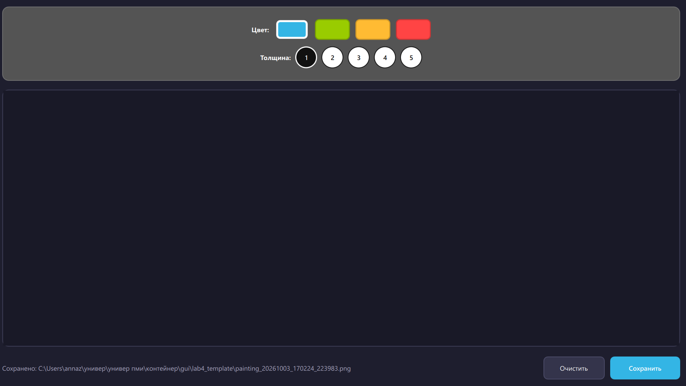

# Основы проектирования графического интерфейса компьютерных систем

# ЛР 4. QML Painter с автосохранением
**Выполнил: студент группы 6231-010402D Жукова Анна**

Каркас из `lab4_template` дополнен классом `Interface` в `main.py`. Бэкенд запускает `QTimer` с интервалом 10 секунд и передаёт QML путь очередного PNG-файла непосредственно в каталог `lab4_template`, рядом с исходным кодом. Резервный QML `Timer` вызывает тот же слот; почти одновременные события объединяются бэкендом. Обработчик `Connections` сначала вызывает `Canvas.save()` в GUI-потоке, а при отказе использует `grabToImage().saveToFile()`. После завершения бэкенд фиксирует последний путь или сообщает об ошибке.

Интерфейс частично сохраняет оформление исходного учебного шаблона: серую верхнюю панель, палитру `#33B5E5`, `#99CC00`, `#FFBB33`, `#FF4444`, два ряда инструментов и контрастные бело-чёрные переключатели толщины. Современная тёмная рабочая область, скругления и нижняя панель действий оставлены. Пользователь может очистить холст и сохранить его вручную. Рисование происходит только при зажатой кнопке мыши. Имена файлов содержат микросекунды, поэтому ручное и автоматическое сохранение не перезаписывают друг друга. Таймер запускается Python-бэкендом после загрузки QML: первое контрольное сохранение выполняется через секунду, последующие — каждые 10 секунд. Фактический путь показывается внизу окна и выводится в консоль.

Запуск из каталога `gui`:

```bash
python3 lab4_template/main.py
```

Файлы сохраняются с именами вида `painting_YYYYMMDD_HHMMSS_ffffff.png`

